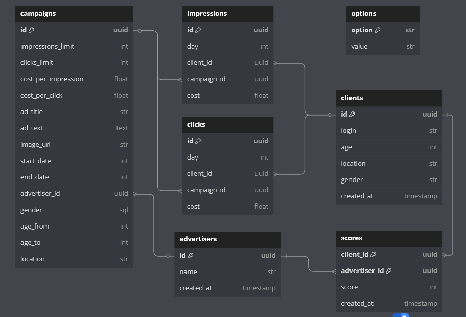
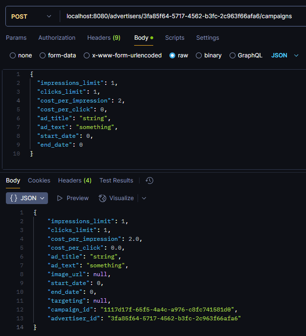
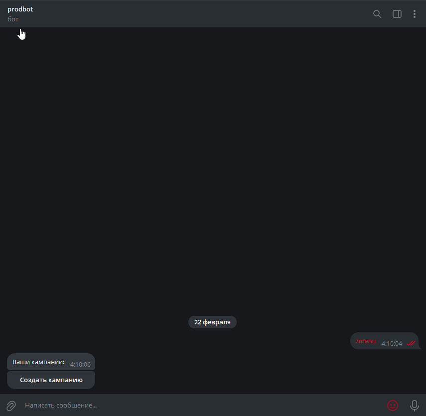

# ad-dicted
### ad-dicted — это рекламный движок, написанный на Python


### Nota Bene!
Данный перевод выполнен автоматически. В случае возникновения недопониманий, пожалуйста, обратитесь к [оригиналу](README.md).

## Навигация
* [Краткое описание](#описание)
  * [Интерфейс](#интерфейс)
  * [Алгоритм](#алгоритм)
* [Быстрый старт](#быстрый-старт)
  * [Конфигурация](#конфигурация)
  * [Запуск сервиса](#запуск-сервиса)
  * [Доступ к OpenAPI](#доступ-к-openapi)
* [Технический обзор](#технический-обзор)
  * [Архитектура](#архитектура)
    * [Слои](#слои)
    * [Зависимости сервиса](#зависимости-сервиса)
    * [Хранилища данных](#хранилища-данных)
  * [Модерация и генерация текста](#модерация-и-генерация-текста)
  * [Разработка](#разработка)
    * [Управление проектом](#управление-проектом)
    * [Линтинг](#линтинг)
    * [Тестирование](#тестирование)
    * [Система контроля версий](#система-контроля-версий)
  * [Схемы](#схемы)
* [Демонстрация использования](#демонстрация-использования)
  * [API](#api)
  * [Бот](#бот)

## Описание
ad-dicted — это рекламный движок, который использует специальный алгоритм для
эффективного подбора релевантных рекламных кампаний для ваших клиентов.

### Интерфейс
ad-dicted предоставляет интерфейс, который позволяет создавать рекламодателей, пользователей и
рекламные кампании. Также можно привязывать «оценки» к парам рекламодатель-пользователь,
что позволяет интегрироваться с любым сервисом оценки релевантности.
В данном случае ad-dicted принимает «ML Scores» — внешний алгоритм машинного обучения
оценивает релевантность рекламы для пользователей, и эти оценки затем используются
в алгоритме ad-dicted.

### Алгоритм
Алгоритм ad-dicted следует двум приоритетам:

1. Прибыль
2. Релевантность (качество выдачи)

Это означает, что при выборе рекламной кампании алгоритм сначала ориентируется
на прибыль, а затем на релевантность. Формула:
* (Нормализованный CPV + Нормализованный CPC) * 2 + Нормализованный Score  
*CPV — стоимость за просмотр*  
*CPC — стоимость за клик*

Алгоритм также отдает приоритет непросмотренным кампаниям перед просмотренными.

Кроме того, ad-dicted позволяет задавать таргетинг для каждой кампании. Если таргетинг
установлен, алгоритм отфильтрует всех несовместимых пользователей.

## Быстрый старт
ad-dicted предоставляет единую точку входа — сервер на [FastAPI](https://github.com/fastapi).
Этот сервер поднимет HTTP-сервер и попытается подключиться к PostgreSQL, Yandex Cloud S3 и Yandex GPT.

### Конфигурация
Перед запуском сервиса необходимо настроить файл «.env».
Скопируйте содержимое «.env.template» в файл «.env» и заполните переменные:

...

### Запуск сервиса
Доступны два варианта запуска:

1. **Запуск вручную**
    ```shell
    uv sync  # Установка зависимостей
    source .venv/bin/activate  # Активация виртуального окружения
    fastapi run app/adapters/fastapi/main.py  # Запуск сервера
    ```
2. **Запуск через docker-compose**
    ```shell
    docker compose up --build
    ```
    Либо конкретный сервис:
    ```shell
    docker compose up [postgres,grafana,backend,bot]
    ```

### Доступ к OpenAPI
FastAPI сервер также предоставляет документацию Swagger, доступную по эндпоинту **/docs**.

## Технический обзор

### Архитектура
ad-dicted разрабатывался с учетом расширяемости и качества кода, следуя принципам **SOLID** и **Чистой архитектуры**.

#### Слои
Кодовая база ad-dicted разделена на 4 слоя:
* **Domain Layer**
  * Usecases
  * Entities
  * Repository interfaces
* **Adapters Layer**
  * Input-output frameworks integration (i.e. FastAPI)
* **Infrastructure layer**
  * Data persistence \ retrieval
    * SQL Repositories
    * S3 Storages
    * AI Interactors (i.e. YandexGPT)

Или же в форме плоского "графа" зависимостей:  
*Adapters => Domain usecases => Domain entities <= Data Persistence \ retrieval*

#### Зависимости сервиса

Фактически, ad-dicted не зависит от PostgreSQL, S3 и даже YandexGPT. Основная бизнес-логика основана на интерфейсах (абстрактных классах), реализации которых уже предоставлены вам — с использованием PostgreSQL, S3 и YandexGPT. Следовательно, вы всегда можете переключиться на ChatGPT, DeepSeek, файловое хранилище, MySQL, Mongo, Redis — практически на что угодно, что выполняет ту же задачу. Никаких ограничений.

Как вы, возможно, уже догадались, такой подход также делает ad-dicted независимым от FastAPI и HTTP в целом! Если захотите, вы всегда можете создать полноценное десктопное приложение, мобильное приложение или CLI — базовое поведение останется неизменным.

#### Хранилища данных

При создании рекламной кампании вы можете ввести URL-адрес изображения, чтобы привязать изображение к новой кампании. 
Чтобы упростить процесс получения URL-адресов изображений, адаптер FastAPI в ad-dicted предлагает пользователям два эндпоинта, позволяющие загружать и скачивать изображения. Так как хранение изображений в PostgreSQL иногда бывает более хлопотным, чем следовало бы, ad-dicted использует S3 для хранения тяжелых данных. Кроме того, ad-dicted предлагает файловое хранилище, которое можно использовать, например, для тестов.

Таким образом, простой сценарий загрузки/получения изображения для кампании потребует от пользователя загрузить изображение, затем фронтенд-клиент отправит запрос на загрузку изображения на сервер. Позже, при получении кампании, фронтенд-клиент отправит запрос на скачивание изображения и выведет его пользователю.

### Модерация и генерация текста

ad-dicted использует YandexGPT для модерации и генерации текстов. Базовый процесс создания рекламной кампании и модерации её текста выглядит так:

1. (опционально) Вызов эндпоинта генерации описания для создания текста кампании
2. Вызов эндпоинта модерации описания для предварительной проверки текста кампании
3. Создание кампании

Если пользователь попытается создать кампанию без вызова эндпоинта модерации, ad-dicted все равно выполнит проверку текста кампании и заменит его на "[ MEGAZORDED ]" в случае обнаружения неподобающего содержания.

## Разработка
### Управление проектом
ad-dicted использует менеджер пакетов **uv** для управления зависимостями и виртуальными окружениями.

### Линтинг
Проект строго придерживается стандартов качества кода, используя **ruff** и **isort**.

### Тестирование

ad-dicted содержит модульные тесты для ключевой бизнес-логики и end-to-end тесты для адаптера FastAPI.
Важно отметить, что модульные тесты могут выполняться полностью независимо от хранилищ данных и внешних сервисов:
все вызовы PostgreSQL заменяются на вызовы в памяти, все вызовы S3 заменяются файловой системой во временном каталоге,
а все вызовы YandexGPT — на заглушки. Это сделано для того, чтобы модульные тесты были максимально независимыми.
Вы также можете включить этот режим вручную, используя переменную окружения `DEBUG`.

Для запуска тестов используйте команду `pytest [dir]`. Перед этим убедитесь, что у вас установлены все зависимости,
чтобы тесты выполнялись корректно. Пример:

```shell
cd solution
pip install uv
uv sync
. .venv/bin/activate
pytest app/tests/unit
```

Также обратите внимание, что для выполнения end-to-end тестов требуется запущенный сервер на `localhost:8080`.

### Система контроля версий
Используется стандартное соглашение коммитов:

`действие(область): описание`

Пример:

`feat(infra/yandexgpt): реализован интерактор YandexGPT`

## Схемы
ad-dicted использует следующую реляционную схему SQL:


## Демонстрация использования
### API
Вы можете протестировать API с помощью e2e тестов или вручную через Postman:


### Бот
Бот является минималистичной реализацией пользовательского взаимодействия:

