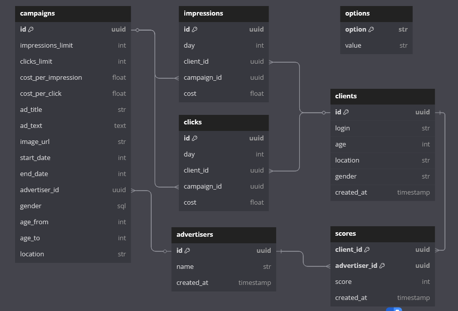
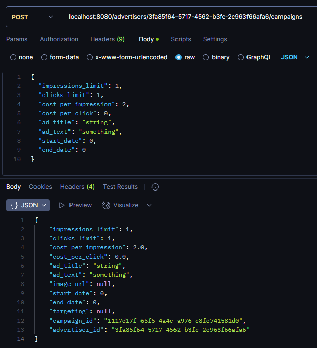

# ad-dicted
### ad-dicted is an advertisement engine written in python


## Navigation
* [Brief Description](#description)
  * [Interface](#interface)
  * [Algorithm](#algorithm)
* [Quick start](#quick-start)
  * [Configuration](#configuration)
  * [Starting the service](#starting-the-service)
  * [Accessing openapi docs](#accessing-openapi)
* [Technical overview](#technical-overview)
  * [Architecture](#architecture)
    * [Layers](#layers)
    * [Service Dependencies](#service-dependencies)
    * [Data Storages](#data-storages)
    * [Moderation And Text Generation](#moderation-and-text-generation)
  * [Development](#development)
    * [Project Management](#project-management)
    * [Linting](#linting)
    * [Testing](#testing)
    * [VCS](#vcs)
  * [Schemas](#schemas)
  * [Usage Demonstration](#usage-demonstration)
    * [API](#api)
    * [Bot](#bot)

## Description
ad-dicted is an advertisement engine which utilizes a special algorithm to
effectively pick relevant advertisement campaigns for your clients.

### Interface
ad-dicted provides an interface that lets you create advertisers, users,
advertising campaigns. You can also bind "scores" to pairs between advertisers and users,
thus, making an integration with any other relevancy evaluation service possible.
In this concrete use case, ad-dicted accepts "ML Scores" - you would use an external
machine learning model, which would produce relevancy scores between clients and advertisers, 
which would be later used in ad-dicted's algorithm.

### Algorithm
ad-dicted algorithm follows two priorities:

1. Profit
2. Relevancy (output quality)  

This means that when the algorithm decides which campaign to output, it prioritizes 
service profit over relevancy. To simplify:
* (Normalized CPV + Normalized CPC) * 2 + Normalized Score  
*CPV - Cost Per View*  
*CPC - Cost Per Click*

The algorithm also prioritizes unviewed campaigns before viewed ones.

ad-dicted also allows you to set targeting scopes for each campaign. 
If set, ad-dicted will filter out all non-compatible users for the campaign.

## Quick start
ad-dicted provides you with one entrypoint out of the box - a server written in [FastAPI](https://github.com/fastapi).
This entrypoint will start up an HTTP server, attempt a connection to postgresql, Yandex Cloud S3 and Yandex GPT.

### Configuration
Before trying to start the service, you have to fill up the ".env" file.
Copy .env.template contents into a file named ".env" and fill up all the variables:
* `SERVER_PORT`: port for fastapi to serve on
* `MODERATE_TEXTS`: whether to moderate texts using YandexGPT
* `DEBUG`: whether to run server in DEBUG mode*


* `TOKEN_TELEGRAM_API`: api token for the telegram bot


* `POSTGRES_USERNAME`: username for the postgres user
* `POSTGRES_PASSWORD`: password for the postgres user
* `POSTGRES_HOST`: postgres instance host
* `POSTGRES_PORT`: postgres instance port
* `POSTGRES_DATABASE`: postgres instance database to work in


* `YANDEX_GPT_CATALOG_IDENTIFIER`: catalog identifier for Yandex GPT API key
* `YANDEX_GPT_API_KEY`: API key for Yandex GPT


* `S3_KEY_IDENTIFIER`: identifier for the Yandex Cloud S3 API key
* `S3_KEY`: API key for Yandex Cloud S3
* `S3_BUCKET` bucket name for Yandex Cloud S3


* `GRAFANA_PORT`: port for grafana service to run through
* `GF_SECURITY_ADMIN_USER`: grafana service admin username
* `GF_SECURITY_ADMIN_PASSWORD`: grafana service admin password

*`DEBUG` controls what storages and external services to use - PostgreSQL,
S3 and YandexGPT or memory storage, filesystem storage & moderation mocks.


### Starting the service
2 options are present:
1. Start up the server manually  
    *N.B.! This option will require you to manually provide the server with an instance of postgresql.*  
    Start the server up using python (requires uv to be installed):
    ```shell
    uv sync  # Install dependencies
    source .venv/bin/activate  # Activate virtual environment
    fastapi run app/adapters/fastapi/main.py  # Start up the server
    ```
2. Use docker-compose
    ```shell
    docker compose up --build
    ```
    Or, a specific service:
    ```shell
    docker compose up [postgres,grafana,backend,bot]
    ```

### Accessing openapi
FastAPI server will also provide you with a swagger instance, serving openapi docs.
You can access the docs at the **/docs** endpoint.
   
## Technical overview
### Architecture
ad-dicted was built with extendability and code quality taken in mind.
ad-dicted follows popular architectural patterns, such as ones which come from **SOLID** and **"Clean Architecture"**.

#### Layers
ad-dicted codebase utilizes 4 layers:
* **Domain Layer**
  * Usecases
  * Entities
  * Repository interfaces
* **Adapters Layer**
  * Input-output frameworks integration (i.e. FastAPI)
* **Infrastructure layer**
  * Data persistence \ retrieval
    * SQL Repositories
    * S3 Storages
    * AI Interactors (i.e. YandexGPT)

As a flat dependency graph:  
*Adapters => Domain usecases => Domain entities <= Data Persistence \ retrieval*

#### Service Dependencies
In fact, ad-dicted doesn't depend on postgresql, S3 and even YandexGPT. Core business logic
relies on interfaces (abstract classes), whose implementations are provided to you - as
implementations using postgresql, S3 and Yandex GPT. Hence, you can always switch to
ChatGPT, DeepSeek, filesystem storage, MySQL, Mongo, Redis - pretty much anything that does the job.
No boundaries.

As you may have alreadly guessed, this approach also makes ad-dicted independent of FastAPI and HTTP at all! 
If you want to, you can always make a whole desktop app, a mobile app, a CLI - core behaviour stays the same.

#### Data Storages
Upon creating a campaign, you can enter an image URL to bind an image to the new campaign.
To simplify the process of acquiring image URLs, ad-dicted FastAPI adapter offers users
two endpoints that let users upload images and download them. As storing images in 
PostgreSQL can sometimes be more of a hassle than it should be, ad-dicted uses S3 in order
to store heavy data. Furthermore, ad-dicted also offers a filesystem-based data storage, which can 
be used, in example, for tests.

So, a simple scenario to upload \ fetch an image to a campaign would require the user to load the image,
then, the frontend client would send a request to upload that image to the server. In latter campaign fetching,
the frontend client would send a request to download the image and output it to the client.

#### Moderation And Text Generation
ad-dicted uses YandexGPT in order to moderate and generate texts. A basic flow for creating a campaign 
& moderating its text would be:
1. (optional) Call description generation endpoint to generate a campaign description
2. Call description moderation endpoint to prevalidate campaign text
3. Create the campaign

If a user attempts to create a campaign without calling the moderation endpoint, ad-dicted will
still run a check on the campaign description and replace it with "[ MEGAZORDED ]" in case of finding
anything nasty.

### Development
#### Project Management
ad-dicted uses a new, fresh project manager named **uv**.
**uv** lets you easily look after dependencies, package & version your projects and manage
virtual environments.

#### Linting
ad-dicted enforces strict code quality rules by using 2 most powerful python linting & formatting tools - 
**ruff** and **isort**. Configs for both are available at *.ruff.toml* and *.isort.cfg*

#### Testing
ad-dicted contains unit tests for core business logic and end-to-end tests for fastapi adapter.
Do note that unit tests can run absolutely independently of any storages or external services:
all PostgreSQL calls are replaced with in-memory calls, all S3 calls are replaced with filesystem calls
in a temporary directory, all YandexGPT calls are mocked. This was implemented specifically for the sole
purpose of making unit tests as independent as they get. You can also turn this behaviour manually, 
by using the `DEBUG` [environment variable](#configuration).

#### VCS
ad-dicted enforces the standard commit convention:  
*action(scope): description*

Example given:
*feat(infra/yandexgpt): implement YandexGPT interactor*

### Schemas
ad-dicted utilizes the following relational SQL schema:


### Usage demonstration
#### API
You can test the api using e2e tests, or manually. For example,
by using postman:


#### Bot
The bot is designed to be a barebones implementation of end user interaction.
Though the bot lacks many features, you can still trace a few use cases through it:

